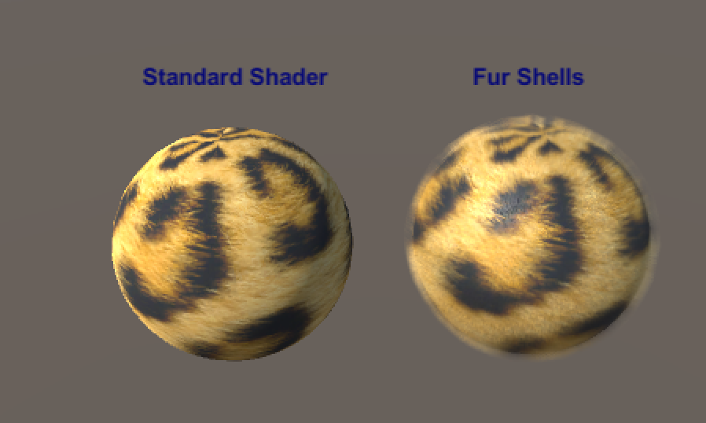
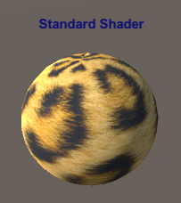
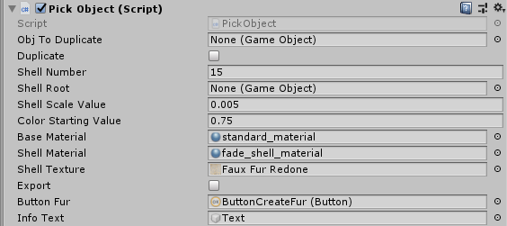

# Quick’n’dirty Fur Shell Demo V1.0

QnFurShell is a demo of the "sheel concept" for Fur rendering in 3D models.

The app is made with Unity, and has been tested & run on Windows & OSX.
You can grab precomplied binaries from the Releases page.

## System Requirements
Unity 2018.3 or more (the script should work on lower version, but the minimum version I used was that one)

The app has been tested on OSX and Windows 10.

## Quick usage

On application start, you'll see on the GameObject on the left (a sphere), the Fur Texture applied as a Standard Shader.
The aspect is very 'flat'.

You can click on any 3D object to select it. **It's on that object that the Fur is going to be created.**

![Image002]Documentation/(interaction.png "")

When the GameObject is selected, the button is enabled.
You can then click on it, to create a series of 'shells', to simulate the aspect of fur.

## Purpose
The goal of this quick POC was to implement a Shell systems in modelization, not shaders.
If you want to export your model on a platform that only uses a 'base shader', and you can't use your own (like Sketchfab for instance), you can't use a shader-based solution.
The solution is to create the geometry, apply the base shader on each new 'layer' (each new shell), with different parameters and keeping the base shader.

## The app
The GUI is minimalistic. When you click on a GameObject, it's selected for Shell creation.
After shells has been created, you can click another object to add shells on it.

All the layers are created under the 'Shell root' node, and can be deleted if the model is further edited in another tool.
![Image008]Documentation/(parameters.png "")

## The script
The exposed parameters helps you fine tune the shell creation.

The 'ObjToDuplicate' is the GameObject that is going to be duplicated and rescaled. 
The **'Shell Number'** is the number of shells that are going to be created.
The **'The Shell Scale Value'** is the amount of 'rescale' or shift between each layer.
The **'Color Starting Value'** is the darkening value at which the color is going to start. Since the layers are duplicated outward from the mesh, the layers that are closer to the original mesh are going to be darkened.
The **'Base Material'** is the shader with the original shader, and the **'Shell Material'** is the Material that is 'Fade'. 

## The texture
The test texture has an albedo value ![Image004]Documentation/(fur_albedo.png "") and a transparency(alpha) layer ![Image005]Documentation/(alpha.png "").
The dot pattern on the alpha channel helps to perceive 'strands'. You can tweak it to change the aspect.

## How it works

### Algorithm
To create fur/hairs, few techniques can be used in 3D rendering.
The most powerful but also the most ressource consuming is the full blown physic simulation on hair strands.
Less costly is the use of '**cards**' or '**shells**'. 

**Cards** are quads that stick out of the 3D model, with a texture applied on it.
If the texture applied on it has an alpha channel, the accumulation of differents cards along the view direction can create a feeling of hairs out of order.

**Shells** are duplications of the base mesh, along the normal of each face. On each of those duplicated mesh, a texture is applied, with some transparency value on it.
The accumulation of layers, with the proper alpha pattern can lead to illusion of hair strands.

In Unity, you can see when selecting the layers that the more outwards the selected layer is, the fewer parts of it can be seen.
[Image006]Documentation/(screen_shells3.png "")

### Limitations

In this demo, we keep the same Standard Shader parameters along all the shell layers. You can manage a List of different shader, and change them accordingly, depending on the depth of the layer.
This could help having a better 'feel' for the fur.
When the model is seen close to the camera, the various layers can be seen, and the illusion is broken.
[Image007]Documentation/(screen_shells2.png "")

## TODO
Export the newly created model as FBX or GLTF.
Add different textures & parameters for different layers (for example, the deeper the layer, the darker the colors).

## License
The C# code of the app and the Unity project is MIT licensed : https://github.com/github-for-unity/Unity/blob/master/LICENSE
